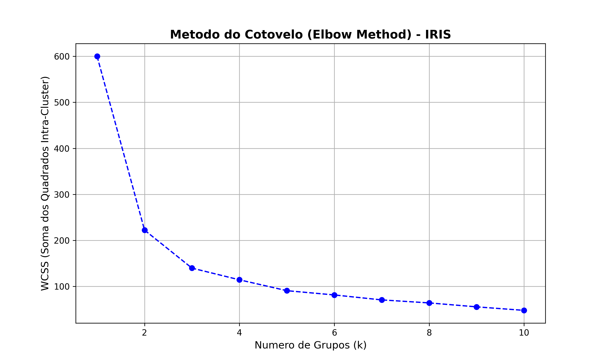
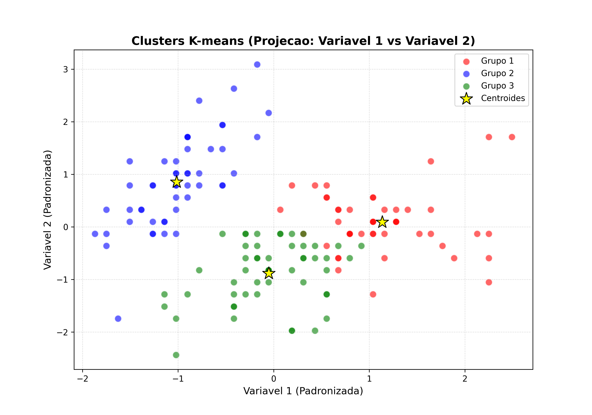

#+TITLE: Resolucao do Exercicio 1 - Estatistica Multivariada
#+AUTHOR: Wagner com ajuda do Gemini CLI
#+OPTIONS: toc:2

* Introducao
Este documento apresenta a resolucao da lista 1 de exercicios do nosso
curso de introducao a analise estatística multivariada

Todos os scripts estao localizados na pasta =src/=.

Para mais detalhes tudo que foi tealizado inclusive notas de estudos
pode ser acessados em
https://github.com/wagnermarques/curso_estatistica_multivariada

O código que produziu estes restulados abaixo se encontram neste mesmo
repositório na pasta exercícios/exercicios_1/src

obrigado

* Exercicio 1: Analise de Dados Binarios (Presenca-Ausencia)
O objetivo deste exercicio e analisar a similaridade entre 8 especies com base em dados binarios utilizando diferentes coeficientes.

** Codigo de Carregamento e Processamento
Os dados sao carregados de um arquivo CSV e processados para calcular as matrizes de distancia de Sorensen-Dice e Simple Matching.

#+CAPTION: Script de Analise Binaria
#+INCLUDE: "../src/main_ex1.py" src python

** Resultados: Dendrogramas
Os dendrogramas abaixo mostram como as especies se agrupam de acordo com cada metrica de distancia.

#+CAPTION: Dendrograma utilizando distancia Sorensen-Dice
#+NAME: fig:dendrograma-dice
[[file:figures/dendrograma_sorensen_dice.png]]

#+CAPTION: Dendrograma utilizando distancia Simple Matching
#+NAME: fig:dendrograma-matching
[[file:figures/dendrograma_simple_matching.png]]

* Exercicio 2: Agrupamento K-means no Dataset IRIS
Neste exercicio, exploramos o algoritmo K-means para agrupar flores do dataset IRIS e validamos a qualidade dos grupos formados.

** Abordagem 1: Metodo do Cotovelo (Elbow Method)
Esta abordagem foca em encontrar o numero otimo de grupos (k) analisando a variacao da soma dos quadrados intra-cluster (WCSS).

#+CAPTION: Script K-means com Metodo do Cotovelo
#+INCLUDE: "../src/main_ex2_kmeans_elbow.py" src python

*** Graficos de Validacao do Numero de Grupos
#+CAPTION: Analise do Metodo do Cotovelo

#+CAPTION: Dispersao dos Grupos (Cotovelo)
[[file:figures/kmeans_scatter_iris.png]]

** Abordagem 2: K-means Simples com Validacao Estatistica
Nesta versao, definimos o numero de grupos diretamente e realizamos testes de ANOVA e MANOVA para verificar se os grupos sao estatisticamente distintos.

#+CAPTION: Script K-means Simples e Validacao
#+INCLUDE: "../src/main_ex2_kmeans_simple.py" src python

*** Analise de Resultados
A analise inclui:
- *Crosstab*: Comparacao entre a especie real e o grupo atribuido.
- *ANOVA*: Teste univariado para cada variavel (SEPALLEN, SEPALWID, etc).
- *MANOVA*: Teste multivariado considerando todas as variaveis simultaneamente.

#+CAPTION: Dispersao dos Grupos (Simples)

* Conclusao

Consegui praticar a análise de agrupamento

O Livro do hair não fala do método ebowl de kmeans mas percebi que as
multiplos agrupamentos me pareceu resultar em grupos melhores que no
kmeans simples onde eu escolhi 3 grupos e os grupos foram formados sem
a inteligencia do ebowl.
Já o dendograma é uma técnica mais interessante porque podemos
escolher o ponto de corte. Consegui colocar isso no código, podemos
cortar e obter os grupos.
Agradeço muitíssimo a oportunidade e a compreenção.

# Local Variables:
# org-babel-python-command: "venv/bin/python3"
# End:

* saida completo do ex1 dendograma

#+name: 
#+begin_src shell
(venv) wgn@fedora:~/WORKING/Projects-Srcs/Projects-Srcs-FzlSoft/curso_estatistica_multivariada$ python3 exercicios/exercicio_1/src/main_ex1.py 
--- Primeiras 10 linhas do dataframe ---
  species  loc_1  loc_2  loc_3  loc_4  loc_5  loc_6  loc_7  loc_8  loc_9  loc_10  ...  loc_20  loc_21  loc_22  loc_23  loc_24  loc_25  loc_26  loc_27  loc_28  loc_29  loc_30
0   esp_1      0      0      1      1      0      1      1      0      0       0  ...       1       0       1       0       0       0       1       1       1       0       0
1   esp_2      0      0      1      0      1      0      0      0      1       1  ...       0       0       1       0       0       0       1       0       1       0       0
2   esp_3      0      0      1      0      1      0      0      0      1       1  ...       0       0       1       0       0       1       1       0       1       0       0
3   esp_4      0      0      1      1      0      0      0      0      1       1  ...       0       0       1       0       0       0       1       0       1       0       1
4   esp_5      0      0      1      0      1      0      0      0      1       1  ...       0       0       1       0       0       1       0       0       1       0       0
5   esp_6      1      0      0      0      0      0      1      1      0       0  ...       1       1       1       1       0       0       0       0       0       1       1
6   esp_7      0      0      1      1      1      0      1      0      1       0  ...       0       0       1       1       1       1       0       1       0       0       1
7   esp_8      1      0      0      0      0      1      1      0      1       1  ...       0       1       0       1       0       1       1       0       1       0       0

[8 rows x 31 columns]

--- Matriz de Distancia (Sorensen-Dice) ---
       esp_1  esp_2  esp_3  esp_4  esp_5  esp_6  esp_7  esp_8
esp_1  0.000  0.478  0.500  0.360  0.565  0.680  0.429  0.615
esp_2  0.478  0.000  0.053  0.200  0.111  0.900  0.565  0.524
esp_3  0.500  0.053  0.000  0.238  0.053  0.905  0.500  0.455
esp_4  0.360  0.200  0.238  0.000  0.300  0.818  0.520  0.565
esp_5  0.565  0.111  0.053  0.300  0.000  0.900  0.478  0.524
esp_6  0.680  0.900  0.905  0.818  0.900  0.000  0.600  0.652
esp_7  0.429  0.565  0.500  0.520  0.478  0.600  0.000  0.615
esp_8  0.615  0.524  0.455  0.565  0.524  0.652  0.615  0.000

--- Matriz de Distancia (Simple Matching) ---
       esp_1  esp_2  esp_3  esp_4  esp_5  esp_6  esp_7  esp_8
esp_1  0.000  0.367  0.400  0.300  0.433  0.567  0.400  0.533
esp_2  0.367  0.000  0.033  0.133  0.067  0.600  0.433  0.367
esp_3  0.400  0.033  0.000  0.167  0.033  0.633  0.400  0.333
esp_4  0.300  0.133  0.167  0.000  0.200  0.600  0.433  0.433
esp_5  0.433  0.067  0.033  0.200  0.000  0.600  0.367  0.367
esp_6  0.567  0.600  0.633  0.600  0.600  0.000  0.500  0.500
esp_7  0.400  0.433  0.400  0.433  0.367  0.500  0.000  0.533
esp_8  0.533  0.367  0.333  0.433  0.367  0.500  0.533  0.000

--- Gerando Dendrogramas ---
Dendrograma salvo em: /home/wgn/WORKING/Projects-Srcs/Projects-Srcs-FzlSoft/curso_estatistica_multivariada/exercicios/exercicio_1/src/../text/figures/dendrograma_sorensen_dice.png
Dendrograma salvo em: /home/wgn/WORKING/Projects-Srcs/Projects-Srcs-FzlSoft/curso_estatistica_multivariada/exercicios/exercicio_1/src/../text/figures/dendrograma_simple_matching.png

--- Atribuicao de Grupos (Exemplos) ---

Grupos (Sorensen-Dice, k=3):
  Especie  Grupo
0   esp_1      1
1   esp_2      1
2   esp_3      1
3   esp_4      1
4   esp_5      1
5   esp_6      3
6   esp_7      1
7   esp_8      2

Grupos (Simple Matching, h=0.4):
  Especie  Grupo
0   esp_1      1
1   esp_2      1
2   esp_3      1
3   esp_4      1
4   esp_5      1
5   esp_6      4
6   esp_7      2
7   esp_8      3
(venv)
  wgn@fedora:~/WORKING/Projects-Srcs/Projects-Srcs-FzlSoft/curso_estatistica_multivariada$
#+end_src

* saida completa do kmeans simples

#+name: 
#+begin_src shell
  (venv) wgn@fedora:~/WORKING/Projects-Srcs/Projects-Srcs-FzlSoft/curso_estatistica_multivariada$ python3 exercicios/exercicio_1/src/main_ex2_kmeans_simple.py 
--- Primeiras 10 linhas do dataset IRIS ---
     specie  SEPALLEN  SEPALWID  PETALLEN  PETALWID
0    SETOSA       5.0       3.3       1.4       0.2
1  VIRGINIC       6.4       2.8       5.6       2.2
2  VERSICOL       6.5       2.8       4.6       1.5
3  VIRGINIC       6.7       3.1       5.6       2.4
4  VIRGINIC       6.3       2.8       5.1       1.5
5    SETOSA       4.6       3.4       1.4       0.3
6  VIRGINIC       6.9       3.1       5.1       2.3
7  VERSICOL       6.2       2.2       4.5       1.5
8  VERSICOL       5.9       3.2       4.8       1.8
9    SETOSA       4.6       3.6       1.0       0.2

Dados padronizados (primeiras 5 linhas):
[[-1.02184904  0.55861082 -1.34022653 -1.3154443 ]
 [ 0.67450115 -0.59237301  1.0469454   1.31719939]
 [ 0.79566902 -0.59237301  0.47857113  0.3957741 ]
 [ 1.03800476  0.09821729  1.0469454   1.58046376]
 [ 0.55333328 -0.59237301  0.76275827  0.3957741 ]]

--- Executando K-means (k=3) ---

--- Dados Originais com Atribuicao de Grupos (K-means) ---
     specie  SEPALLEN  SEPALWID  PETALLEN  PETALWID  Grupo
0    SETOSA       5.0       3.3       1.4       0.2      2
1  VIRGINIC       6.4       2.8       5.6       2.2      1
2  VERSICOL       6.5       2.8       4.6       1.5      3
3  VIRGINIC       6.7       3.1       5.6       2.4      1
4  VIRGINIC       6.3       2.8       5.1       1.5      3
5    SETOSA       4.6       3.4       1.4       0.3      2
6  VIRGINIC       6.9       3.1       5.1       2.3      1
7  VERSICOL       6.2       2.2       4.5       1.5      3
8  VERSICOL       5.9       3.2       4.8       1.8      1
9    SETOSA       4.6       3.6       1.0       0.2      2

Contagem por grupo:
Grupo
3    53
2    50
1    47
Name: count, dtype: int64
Grupo
3    53
2    50
1    47
Name: count, dtype: int64

--- Variaveis e Grupos Atribuidos ---

--- Cruzamento: Especie Original vs Grupo K-means ---
Grupo      1   2   3
specie              
SETOSA     0  50   0
VERSICOL  11   0  39
VIRGINIC  36   0  14

--- Gerando Grafico de Dispersao dos Clusters ---
Grafico de Clusters (Scatter) salvo em: /home/wgn/WORKING/Projects-Srcs/Projects-Srcs-FzlSoft/curso_estatistica_multivariada/exercicios/exercicio_1/src/../text/figures/kmeans_scatter_iris_simple.png

--- Analise de Variancia (ANOVA) por Variavel ---
H0: Nao ha diferenca entre as medias dos grupos
H1: Ha pelo menos uma diferenca entre as medias

Variavel: SEPALLEN
F-statistic: 218.5710
p-valor: 9.0932e-45
Resultado: Significativo (Existem diferencas entre os grupos)

Variavel: SEPALWID
F-statistic: 79.9000
p-valor: 3.2655e-24
Resultado: Significativo (Existem diferencas entre os grupos)

Variavel: PETALLEN
F-statistic: 860.6367
p-valor: 7.0300e-82
Resultado: Significativo (Existem diferencas entre os grupos)

Variavel: PETALWID
F-statistic: 525.6988
p-valor: 1.0487e-67
Resultado: Significativo (Existem diferencas entre os grupos)

--- Analise Multivariada de Variancia (MANOVA) ---
H0: Os vetores de medias dos grupos sao iguais
H1: Pelo menos um vetor de media e diferente
                   Multivariate linear model
================================================================
                                                                
----------------------------------------------------------------
       Intercept         Value  Num DF  Den DF   F Value  Pr > F
----------------------------------------------------------------
          Wilks' lambda  0.0104 4.0000 144.0000 3416.6552 0.0000
         Pillai's trace  0.9896 4.0000 144.0000 3416.6552 0.0000
 Hotelling-Lawley trace 94.9071 4.0000 144.0000 3416.6552 0.0000
    Roy's greatest root 94.9071 4.0000 144.0000 3416.6552 0.0000
----------------------------------------------------------------
                                                                
----------------------------------------------------------------
         C(Grupo)         Value  Num DF  Den DF  F Value  Pr > F
----------------------------------------------------------------
           Wilks' lambda  0.0383 8.0000 288.0000 148.0632 0.0000
          Pillai's trace  1.3728 8.0000 290.0000  79.3376 0.0000
  Hotelling-Lawley trace 14.3967 8.0000 203.4024 258.0786 0.0000
     Roy's greatest root 13.6070 4.0000 145.0000 493.2547 0.0000
================================================================

(venv) wgn@fedora:~/WORKING/Projects-Srcs/Projects-Srcs-FzlSoft/curso_estatistica_multivariada$ 

#+end_src

* saída completa do kmeans com ebowol

#+name: 
#+begin_src shell
(venv) wgn@fedora:~/WORKING/Projects-Srcs/Projects-Srcs-FzlSoft/curso_estatistica_multivariada$ python3 exercicios/exercicio_1/src/main_ex2_kmeans_elbow.py 
--- Primeiras 10 linhas do dataset IRIS ---
     specie  SEPALLEN  SEPALWID  PETALLEN  PETALWID
0    SETOSA       5.0       3.3       1.4       0.2
1  VIRGINIC       6.4       2.8       5.6       2.2
2  VERSICOL       6.5       2.8       4.6       1.5
3  VIRGINIC       6.7       3.1       5.6       2.4
4  VIRGINIC       6.3       2.8       5.1       1.5
5    SETOSA       4.6       3.4       1.4       0.3
6  VIRGINIC       6.9       3.1       5.1       2.3
7  VERSICOL       6.2       2.2       4.5       1.5
8  VERSICOL       5.9       3.2       4.8       1.8
9    SETOSA       4.6       3.6       1.0       0.2

Dados padronizados (primeiras 5 linhas):
[[-1.02184904  0.55861082 -1.34022653 -1.3154443 ]
 [ 0.67450115 -0.59237301  1.0469454   1.31719939]
 [ 0.79566902 -0.59237301  0.47857113  0.3957741 ]
 [ 1.03800476  0.09821729  1.0469454   1.58046376]
 [ 0.55333328 -0.59237301  0.76275827  0.3957741 ]]

--- Analise do Numero Otimo de Grupos (Metodo do Cotovelo) ---
Grafico do Cotovelo salvo em: /home/wgn/WORKING/Projects-Srcs/Projects-Srcs-FzlSoft/curso_estatistica_multivariada/exercicios/exercicio_1/src/../text/figures/kmeans_elbow_iris.png

--- Executando K-means (k=3) ---

--- Dados Originais com Atribuicao de Grupos (K-means) ---
     specie  SEPALLEN  SEPALWID  PETALLEN  PETALWID  Grupo
0    SETOSA       5.0       3.3       1.4       0.2      2
1  VIRGINIC       6.4       2.8       5.6       2.2      1
2  VERSICOL       6.5       2.8       4.6       1.5      3
3  VIRGINIC       6.7       3.1       5.6       2.4      1
4  VIRGINIC       6.3       2.8       5.1       1.5      3
5    SETOSA       4.6       3.4       1.4       0.3      2
6  VIRGINIC       6.9       3.1       5.1       2.3      1
7  VERSICOL       6.2       2.2       4.5       1.5      3
8  VERSICOL       5.9       3.2       4.8       1.8      1
9    SETOSA       4.6       3.6       1.0       0.2      2

Contagem por grupo:
Grupo
3    53
2    50
1    47
Name: count, dtype: int64

--- Cruzamento: Especie Original vs Grupo K-means ---
Grupo      1   2   3
specie              
SETOSA     0  50   0
VERSICOL  11   0  39
VIRGINIC  36   0  14

--- Gerando Grafico de Dispersao dos Clusters ---
Grafico de Clusters (Scatter) salvo em: /home/wgn/WORKING/Projects-Srcs/Projects-Srcs-FzlSoft/curso_estatistica_multivariada/exercicios/exercicio_1/src/../text/figures/kmeans_scatter_iris.png

--- Analise de Variancia (ANOVA) por Variavel ---
H0: Nao ha diferenca entre as medias dos grupos
H1: Ha pelo menos uma diferenca entre as medias

Variavel: SEPALLEN
F-statistic: 218.5710
p-valor: 9.0932e-45
Resultado: Significativo (Existem diferencas entre os grupos)

Variavel: SEPALWID
F-statistic: 79.9000
p-valor: 3.2655e-24
Resultado: Significativo (Existem diferencas entre os grupos)

Variavel: PETALLEN
F-statistic: 860.6367
p-valor: 7.0300e-82
Resultado: Significativo (Existem diferencas entre os grupos)

Variavel: PETALWID
F-statistic: 525.6988
p-valor: 1.0487e-67
Resultado: Significativo (Existem diferencas entre os grupos)

--- Analise Multivariada de Variancia (MANOVA) ---
H0: Os vetores de medias dos grupos sao iguais
H1: Pelo menos um vetor de media e diferente
                   Multivariate linear model
================================================================
                                                                
----------------------------------------------------------------
       Intercept         Value  Num DF  Den DF   F Value  Pr > F
----------------------------------------------------------------
          Wilks' lambda  0.0104 4.0000 144.0000 3416.6552 0.0000
         Pillai's trace  0.9896 4.0000 144.0000 3416.6552 0.0000
 Hotelling-Lawley trace 94.9071 4.0000 144.0000 3416.6552 0.0000
    Roy's greatest root 94.9071 4.0000 144.0000 3416.6552 0.0000
----------------------------------------------------------------
                                                                
----------------------------------------------------------------
         C(Grupo)         Value  Num DF  Den DF  F Value  Pr > F
----------------------------------------------------------------
           Wilks' lambda  0.0383 8.0000 288.0000 148.0632 0.0000
          Pillai's trace  1.3728 8.0000 290.0000  79.3376 0.0000
  Hotelling-Lawley trace 14.3967 8.0000 203.4024 258.0786 0.0000
     Roy's greatest root 13.6070 4.0000 145.0000 493.2547 0.0000
================================================================

(venv) wgn@fedora:~/WORKING/Projects-Srcs/Projects-Srcs-FzlSoft/curso_estatistica_multivariada$ 
#+end_src

