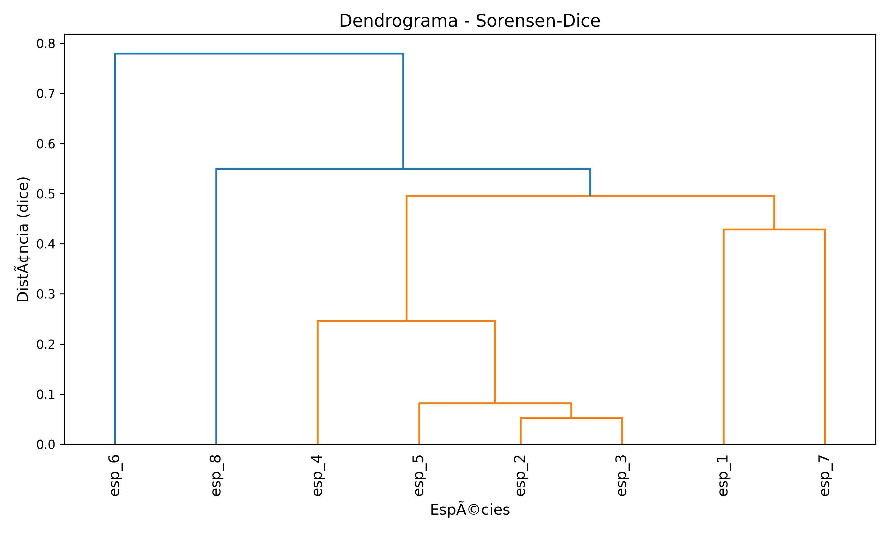
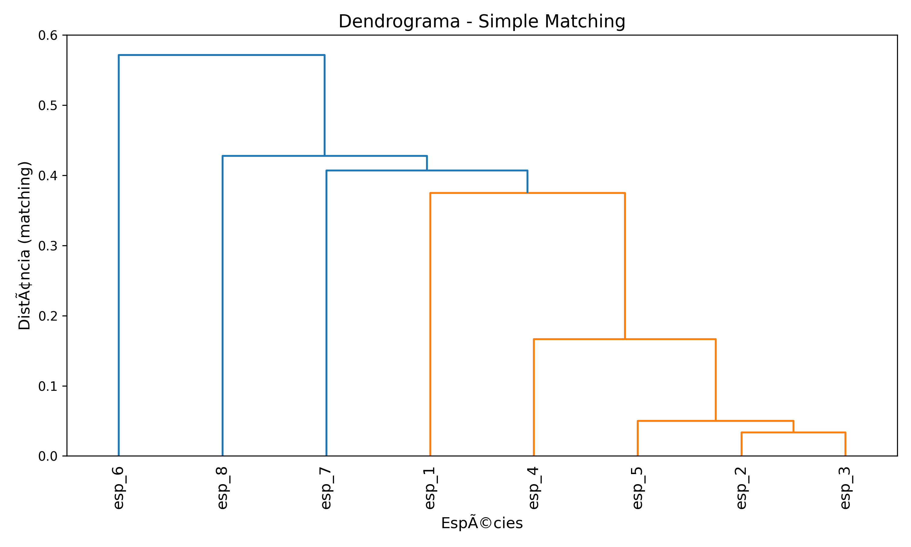

#+TITLE: Resolução do Exercício 1 - Estatística Multivariada
#+AUTHOR: Wagner com ajuda do Gemini CLI
#+OPTIONS: toc:2

* Introdução
Este documento apresenta a resolução passo a passo dos exercícios propostos, utilizando Python para análise de dados multivariados.

Os scripts python estao na pasta =src/=.

*  cria csv a partir do pdf

* Exercício 1: Análise de Dados Binários
Considere a Tabela 1 com valores de presença-ausência de 8 espécies.

** Objetivo: Gerar dendrogramas utilizando os coeficientes de Sorensen-Dice e Simple Matching.

** 1.1 Carga de Dados
Utilizamos o script =read_csv.py= para carregar os dados.

#+name: ex1-carga
#+begin_src python :session multivariada :results output
  #import read_csv
  #df_bin = read_csv.read_data()
  #print("Dados da Tabela 1 carregados:")
  #print(df_bin.head())
  
#+end_src

** 1.2 Agrupamento Hierárquico
Para gerar os dendrogramas, criamos o script =clustering_binario.py= que calcula as matrizes de distância e as plota utilizando o método de agrupamento /Average Linkage/ (UPGMA).

- *Sorensen-Dice*: Mede a similaridade focando apenas nas presenças simultâneas (ignora duplas ausências). No scipy, a métrica =dice= calcula a disimilaridade correspondente.
- *Simple Matching*: Mede a similaridade considerando tanto presenças quanto ausências simultâneas. No scipy, a métrica =matching= calcula a distância.

#+name: ex1-clustering
#+begin_src python :session multivariada :results output
import clustering_binario
clustering_binario.analyze_binary_data(df_bin)
#+end_src

** 1.3 Resultados - Dendrogramas

#+CAPTION: Dendrograma utilizando distância Sorensen-Dice
#+NAME: fig:dendrograma-dice

#+CAPTION: Dendrograma utilizando distância Simple Matching
#+NAME: fig:dendrograma-matching

