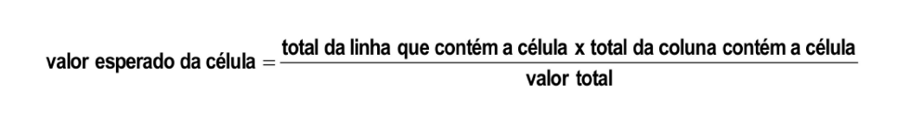

#+Title: Analise de Correspondencia
#+Language: pt-br
#+OPTIONS: tex:t
#+HTML_MATHJAX: align: left indent: 5em tagside: left font: Neo-Euler

* vendo nossos dados e introduzindo qui quadrado

O qui quadrado tem um tipo de padronização dos valores pra poder fazer
a comparacao

Olhando os dados abaixo, podemos perceber que o total marginal da coluna refrigerante he 140 e do
cha 88. Ou seja tem muito mais pessoas que tomam refrigetente que cha.

Por esse motivo fica muito dificil so olhando pra tabela de
contigencia comparar 55 com 3 pra dizer que crianças tomam mais
regrigerante que cha. Nao parece errado por intuicao mas o 55 ta
inflado pelo total marginal muito maior.

O valore esperado de cada celular vai prover um valor pra cada celula
e aí sem da pra comparar 55 com o valor esperado da celula e o 3 com o
valor esperado da respectiva celular.

Com base nessa base de comparacao a estatistica qui quadrado he construida

#+name: head-data
#+begin_src shell :exports both :results output
  ../../venv/bin/python3 ../../scripts/data.py head ../../data/exerc_ana_corresp_regrigerante_tabela_contingencia.csv
#+end_src

Abaixo temos a mesma saida so que mostrando os valores esperados

#+name: qui2-summary
#+begin_src shell :exports both :results output
  ../../venv/bin/python3 ../../scripts/stat_qui2.py --show-expected-values ../../data/exerc_ana_corresp_regrigerante_tabela_contingencia.csv
#+end_src

#+RESULTS: qui2-summary

* Entendendo o calculo do qui quadrado

** Valor Esperado (Freq Esperada) da Celula

#+Caption: fonte: slides do prof

Na literatura o valor esperado he indicado geralmente por ($E_{ij}$)

O Livro Hair nao traz formulas porque é mais conceitual, mas explica
bem sobre a analise de correspondencia.

Conforme conversamos aqui neste texto um pouco antes o motivo pelo
qual se calcula o valor esperado pra cada celular. O livro do Hair
explica bem que é o valor esperado que "padroniza" e dá base pra
comparacao.

o valor esperado ($E_{ij}$) de cada celular, tambem chamado na
  literatura como frequencia esperada é calculada com a formula
  abaixo onde as linhas sao indentificadas pelo indice  $i$ e as
  colunas  $j$ is:

#+name: qui2-expected-formula
#+begin_src shell :results raw :exports both
  VENV_PATH=$(readlink -f ../../venv/bin/python3)
  FORMULA=$($VENV_PATH ../../scripts/math_latex.py qui2-expected-values --raw)
  echo "\[ $FORMULA \]"
#+end_src

#+RESULTS: qui2-expected-formula
\[ E_{ij} = \frac{C_{j} R_{i}}{n} \]

Onde:
 - $R_i$: total da linha que contem a celula Soma das linhas $i$ (Total Marginal da linha).
 - $C_j$: total da coluna que contem a celula $j$ (Total Marginal da coluna).
 - $n$: Total Geral

** Estatistica Qui-Quadrado ($\chi^2$)

A estatistica qui-quadrado total he a soma das contribuicoes de cada celula

#+name: qui2-stat-formula
#+begin_src shell :results raw :exports both
  VENV_PATH=$(readlink -f ../../venv/bin/python3)
  FORMULA=$($VENV_PATH ../../scripts/math_latex.py qui2-stat --raw)
  echo "\[ $FORMULA \]"
#+end_src

#+RESULTS: qui2-stat-formula
\[ \chi^{2} = \sum_{\substack{1 \leq i \leq r\\1 \leq j \leq c}} \frac{\left(- E_{ij} + O_{ij}\right)^{2}}{E_{ij}} \]

