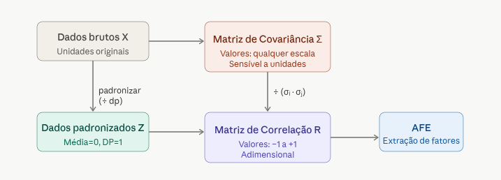
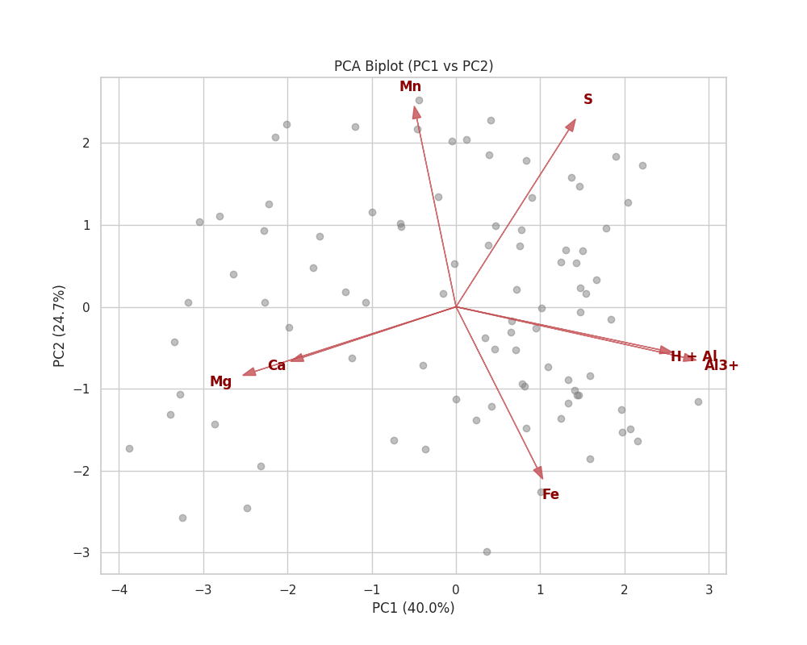
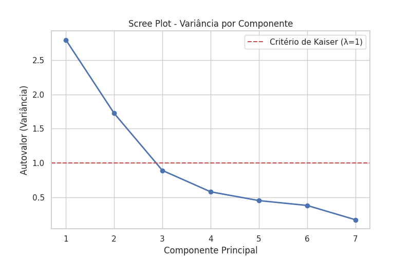

#+Title: Análise Fatorial Exploratória (EFA - Exploratory Factorial Analysis)
#+Author: Eu e o Gemini
#+Date: 2026-06-07
#+Language: pt-br

* Introdução

Este documento sao anotacoes de estudo sobre Análise Fatorial Exploratória (AFE)

Detalhada dos dados de química do solo contidos no arquivo =quimica_do_solo.xlsx=.

O objetivo é realizar a mesma análise que o nosso professor fez nas
aulas, utilizando algebra matricial pra entender os passos e o
mecanismo da técnica e encontrar os mesmos resultados que o professor
encontrou usando o statistica.

A análise segue os passos matemáticos clássicos utilizando álgebra matricial e a biblioteca SymPy para representação simbólica.

Seguindo a orientacao do professor, sempre que oportuno vou fazer
analises para melhorar a compreensao do que esta sendo apresentado.

* Passo 1: Carregamento e Preparação dos Dados

Os dados consistem em 90 amostras de solo com 7 variáveis quantitativas.

As variáveis analisadas são:
- *Ca*: Cálcio
- *Mg*: Magnésio
- *H + Al*: Acidez potencial
- *Al3+*: Alumínio trocável
- *S*: Soma de bases (ou enxofre, dependendo do contexto, aqui tratado como S)
- *Fe*: Ferro
- *Mn*: Manganês

** Padronização das variaveis

#+begin_src python :results output :exports both
from sympy import symbols, Matrix, latex

x, mu, sigma = symbols('x mu sigma')
z = (x - mu) / sigma
print(f"Fórmula de Padronização: {latex(z)}")
#+end_src

#+RESULTS:

A fórmula matemática é:
\[ Z = \frac{X - \mu}{\sigma} \]

** Script para Padronização dos Dados
O código abaixo realiza a leitura dos dados originais, aplica a padronização Z-score e exporta o resultado para um arquivo CSV. Este script pode ser extraído para um arquivo Python independente.

#+begin_src python :results output :exports both :tangle standardize_data.py
import pandas as pd
import os

# Determina o diretório onde o script está localizado
script_dir = os.path.dirname(os.path.abspath(__file__)) if '__file__' in locals() else os.getcwd()

# Caminhos dos arquivos baseados na localização do script
input_file = os.path.join(script_dir, '../../quimica_do_solo.xlsx')
output_file = os.path.join(script_dir, 'dados_padronizados.csv')

# Normaliza os caminhos para evitar problemas com ../
input_file = os.path.normpath(input_file)
output_file = os.path.normpath(output_file)

if not os.path.exists(input_file):
    print(f"Erro: Arquivo {input_file} não encontrado.")
else:
    # Carregamento dos dados
    cols = ['Ca', 'Mg', 'H + Al', 'Al3+', 'S', 'Fe', 'Mn']
    df = pd.read_excel(input_file)
    X = df[cols]

    # Cálculo da padronização (Z-score)
    df_std = (X - X.mean()) / X.std()

    # Salvar em CSV
    df_std.to_csv(output_file, index=False)
    print(f"Dados padronizados salvos em: {output_file}")
    print("\nPrimeiras linhas dos dados padronizados:")
    print(df_std.head())
#+end_src

#+RESULTS:

#+name: dados padronizados head
#+begin_src shell
(venv) wgn@fedora:/run/media/wgn/ext4/Projects-Srcs/Projects-Srcs-FzlSoft/curso_estatistica_multivariada$ python3 teoria/analise_fatorial_exploratoria/standardize_data.py 
Dados padronizados salvos em: /run/media/wgn/ext4/Projects-Srcs/Projects-Srcs-FzlSoft/curso_estatistica_multivariada/teoria/analise_fatorial_exploratoria/dados_padronizados.csv

Primeiras linhas dos dados padronizados:
         Ca        Mg    H + Al      Al3+         S        Fe        Mn
0  2.421023  2.568326 -1.000292 -1.427352 -1.508906  2.819830  0.344644
1 -0.642253 -0.661305  1.634109  0.862064  1.195651  0.312838  1.524034
2 -0.514616 -0.661305  0.668162  1.116444  1.154673  0.891375  1.406095
3  2.038113  2.106950 -1.000292 -1.427352 -1.508906  1.277066  1.347125
4 -0.259343 -0.661305 -0.122158 -0.155454  0.458045  0.312838  0.757430
(venv) wgn@fedora:/run/media/wgn/ext4/Projects-Srcs/Projects-Srcs-FzlSoft/curso_estatistica_multivariada$ 
#+end_src

* Passo 2: Matriz de Correlação (R)

A matriz de correção he mesmo que a matriz de covariancia aplicada aos
dados padronizados.

A padronizacao he importante porque a matriz de covariancia tem seus
resultados fortemente impactado pelas escalas, mas a padronizacao
resolve isso.

o que temos abaixo he a matriz de covariancia aplicada aos dados
padronizados mas pelo fato de ser identica a matriz de correlacao
chamamos de matriz de correlacao mesmo.

So pra ilustrar que apesar de resultados identicos no nosso caso desta
analise, matriz de covariancia nao he a mesma coisa que matriz de
correlacao, conforme essa imagem gerado pelo claude.

A AFE baseia-se na matriz de correlação entre as variáveis padronizadas.

Seja $Z$ a matriz de dados padronizados ($n \times p$), a matriz de correlação $R$ é dada por:
\[ R = \frac{1}{n-1} Z^T Z \]

No exercicio de componentes principais tem os passos detalhados sobre
como obter  a matriz de correlacao.

De posse da matriz de correlacao, ja temos algumas leituras interessantes diante da correlacao entre as variaveis.

#+begin_table
|        |      Ca |       Mg |    H+Al |    Al3+ |      S |     Fe |     Mn |
|--------+---------+----------+---------+---------+--------+--------+--------|
| *Ca*   |   1.000 |    0.437 |  -0.302 |  -0.375 | -0.337 |  0.028 |  0.126 |
| *Mg*   |   0.437 |    1.000 |  -0.490 |  -0.653 | -0.403 | -0.044 | -0.077 |
| *H+Al* |  -0.302 |   -0.490 |   1.000 | _0.734_ |  0.211 |  0.297 | -0.162 |
| *Al3+* |  -0.375 |   -0.653 | *0.734* |   1.000 |  0.255 |  0.397 | -0.252 |
| *S*    |  -0.337 |   -0.403 |   0.211 |   0.255 |  1.000 | -0.184 |  0.413 |
| *Fe*   | *0.028* | *-0.044* |   0.297 |   0.397 | -0.184 |  1.000 | -0.281 |
| *Mn*   |   0.126 | *-0.077* |  -0.162 |  -0.252 |  0.413 | -0.281 |  1.000 |
#+end_table

A tabela mostra que Al3 tem correlacao forte com H+Al.Claro que aí
precisa de literatura e conhecimento da área pra seber quais as
implicacoes disso.

O Fe tem correlação zero com Ca, Mg e muito baixa com H_Al 0.297, com
Al3+ 0.397 e mais baixa ainda com S -0.184.

Isso quer dizer que a variancia do Fe nao esta relacionada a variancia
da maioria dos outros elementos quimicos.

O Mn já se relaciona fracamente com S 0.413.

Esse primeiro olhar já nos da uma pista do que podemos ter lá na
frente quando encontrar-mos os fatores.

* Passo 3: Decomposição em Autovalores e Autovetores

Pra um resumo bem interessante sobre autovalores e autovetores, achei interessante esse video:
https://www.youtube.com/watch?v=MLck7c2Ma8E&t=1388s

Para extrair os fatores, resolvemos a equação característica:

\[ \det(R - \lambda I) = 0 \]

Onde $\lambda$ são os autovalores. Para cada $\lambda_i$, encontramos
o autovetor $v_i$ tal que:

\[ R v_i = \lambda_i v_i \]

** Script para Extração de Autovalores e Autovetores
Este script lê os dados padronizados, calcula a matriz de correlação e
extrai os autovalores e autovetores.

#+begin_src python :results output :exports both :tangle extract_eigen.py
import pandas as pd
import numpy as np
import os

# Localização do script e arquivos
script_dir = os.path.dirname(os.path.abspath(__file__)) if '__file__' in locals() else os.getcwd()
input_file = os.path.join(script_dir, 'dados_padronizados.csv')

if not os.path.exists(input_file):
    print(f"Erro: Arquivo {input_file} não encontrado. Execute o script de padronização primeiro.")
else:
    # Carregar dados padronizados
    df_std = pd.read_csv(input_file)
    
    # Calcular matriz de correlação (R)
    R = df_std.corr()
    
    # Extrair autovalores e autovetores
    eigenvalues, eigenvectors = np.linalg.eig(R)
    
    # Ordenar de forma decrescente
    idx = eigenvalues.argsort()[::-1]
    eigenvalues = eigenvalues[idx]
    eigenvectors = eigenvectors[:, idx]
    
    print("=== Resultados da Decomposição Espectral ===")
    print("\nAutovalores (Variância Explicada por cada componente):")
    for i, val in enumerate(eigenvalues):
        variancia_perc = (val / len(eigenvalues)) * 100
        print(f"Componente {i+1}: {val:.4f} ({variancia_perc:.2f}%)")
        
    print("\nMatriz de Autovetores (V) - Primeiros 2 componentes:")
    df_v = pd.DataFrame(eigenvectors[:, :2], index=df_std.columns, columns=['V1', 'V2'])
    print(df_v)
#+end_src

a linha que extrai os autovalores e autovetores é np.linalg.eig(R)

pra entender melhor como o numpy trabalhar com algebra linear, esta he
a documentacao: https://numpy.org/doc/stable/reference/routines.linalg.html

** Autovalores Obtidos:

#+name: 
#+begin_src shell
  (venv) wgn@fedora:/run/media/wgn/ext4/Projects-Srcs/Projects-Srcs-FzlSoft/curso_estatistica_multivariada$ python3 teoria/analise_fatorial_exploratoria/extract_eigen.py 
  === Resultados da Decomposição Espectral ===
  
  Autovalores (Variância Explicada por cada componente):
  Componente 1: 2.7974 (39.96%)
  Componente 2: 1.7257 (24.65%)
  Componente 3: 0.8920 (12.74%)
  Componente 4: 0.5799 (8.28%)
  Componente 5: 0.4519 (6.46%)
  Componente 6: 0.3807 (5.44%)
  Componente 7: 0.1724 (2.46%)

  Matriz de Autovetores (V) - Primeiros 2 componentes:
                V1        V2
  Ca     -0.363171 -0.156996
  Mg     -0.476468 -0.200491
  H + Al  0.482937 -0.133232
  Al3+    0.539410 -0.156802
  S       0.267106  0.549150
  Fe      0.192170 -0.499852
  Mn     -0.092840  0.584294
  (venv) wgn@fedora:/run/media/wgn/ext4/Projects-Srcs/Projects-Srcs-FzlSoft/curso_estatistica_multivariada$ 
#+end_src

| Componente | Autovalor ($\lambda$) | % Variância | % Acumulada |
|------------+----------------------+-------------+-------------|
| 1          | 2.797                | 39.96%      | 39.96%      |
| 2          | 1.726                | 24.66%      | 64.62%      |
| 3          | 0.892                | 12.74%      | 77.36%      |
| 4          | 0.580                | 8.28%       | 85.64%      |
| 5          | 0.452                | 6.46%       | 92.10%      |
| 6          | 0.381                | 5.44%       | 97.54%      |
| 7          | 0.172                | 2.46%       | 100.00%     |

Pelo critério de Kaiser ($\lambda > 1$), reteríamos 2 fatores.

No exercicio sobre componentes principais nao cheguei a fazer uma
analise dos componentes encontrados, mas esse e uma boa oportunidade.

Olhando abaixo, percebe-se claramente que os dois primeiro componentes
principais não só sao os que explicam a mario parte da variancia
(64,96%) mas tambem percebemos que o terceiro componente principal cai
expressivamente. Algumas literaturas chamam isso de cotovelo (ewboll)
posso estar escrevento errado o nome em ingles.

| Componente | Autovalor ($\lambda$) | % Variância | % Acumulada |
|------------+----------------------+-------------+-------------|
| 1          | 2.797                | 39.96%      | 39.96%      |
| 2          | 1.726                | 24.66%      | 64.62%      |

* Passo 4: Interpretação da PCA e Visualização (antes de entrar no efa)

antes de entrar no efa achei interessante aproveitar este estagio
intermediario de pca pra dar uma olhada.

64% acho pouco, entao já estou esperando uma analise visual nao tao
obvia

** 4.1 Scree Plot (Gráfico de Cotovelo)

O Scree Plot ajuda a visualizar a queda na variância explicada e confirmar o número de componentes a reter.

#+begin_src python :results output :exports both :tangle visualize_pca.py
import pandas as pd
import numpy as np
import matplotlib.pyplot as plt
import seaborn as sns
import os

# Configurações de estilo
sns.set_theme(style="whitegrid")

# Localização dos arquivos
script_dir = os.path.dirname(os.path.abspath(__file__)) if '__file__' in locals() else os.getcwd()
input_file = os.path.join(script_dir, 'dados_padronizados.csv')
img_dir = os.path.join(script_dir, 'imgs')

if not os.path.exists(img_dir):
    os.makedirs(img_dir)

if os.path.exists(input_file):
    df_std = pd.read_csv(input_file)
    R = df_std.corr()
    eigenvalues, eigenvectors = np.linalg.eig(R)
    
    # Ordenar
    idx = eigenvalues.argsort()[::-1]
    eigenvalues = eigenvalues[idx]
    eigenvectors = eigenvectors[:, idx]
    
    # 1. Scree Plot
    plt.figure(figsize=(8, 5))
    plt.plot(range(1, len(eigenvalues)+1), eigenvalues, 'o-', linewidth=2)
    plt.title('Scree Plot - Variância por Componente')
    plt.xlabel('Componente Principal')
    plt.ylabel('Autovalor (Variância)')
    plt.axhline(y=1, color='r', linestyle='--', label='Critério de Kaiser (λ=1)')
    plt.legend()
    plt.savefig(os.path.join(img_dir, 'pca_scree_plot.png'))
    plt.close()

    # 2. Biplot (Cargas e Scores)
    # Cálculo dos scores: Z * V
    scores = df_std.values @ eigenvectors
    
    plt.figure(figsize=(10, 8))
    # Plotar os scores das amostras
    plt.scatter(scores[:, 0], scores[:, 1], alpha=0.5, color='gray', label='Amostras')
    
    # Plotar os vetores das variáveis (Cargas fatoriais: V * sqrt(L))
    loadings = eigenvectors[:, :2] * np.sqrt(eigenvalues[:2])
    
    for i, var in enumerate(df_std.columns):
        plt.arrow(0, 0, loadings[i, 0]*3, loadings[i, 1]*3, color='r', alpha=0.8, head_width=0.1)
        plt.text(loadings[i, 0]*3.5, loadings[i, 1]*3.5, var, color='darkred', ha='center', va='center', fontweight='bold')

    plt.title('PCA Biplot (PC1 vs PC2)')
    plt.xlabel(f'PC1 ({ (eigenvalues[0]/sum(eigenvalues))*100:.1f}%)')
    plt.ylabel(f'PC2 ({ (eigenvalues[1]/sum(eigenvalues))*100:.1f}%)')
    plt.grid(True)
    plt.savefig(os.path.join(img_dir, 'pca_biplot.png'))
    plt.close()
    
    print("Gráficos gerados com sucesso em teoria/analise_fatorial_exploratoria/imgs/")
#+end_src

uma descricao inicial do grafico biplot abaixo seria: Os eixos X e Y
sao os scores. Os pontos sao os casos plotados como grafico de
dispersao considerando o score de cada componente principal.

Os casos sao agrupados de acordo com as setas vermelhas que sao as
variaveis originais (loadings)

Dessa maneira podemos ver como as variaveis originais se relacionam
com os componentes e também os casos relativos a ela.

Por exemplo, apesar de, aparentemente, os casos estarem bem dispersos,
não revelando facilmente grupos de casos, percebe-se que existem casos
com solos para todas caracteristicas. Mas considerando que o terceiro
e quarto quadrante é maior, observa-se que todos eles, apesar de
dispersos, esto relacionados com Mg e Ca que, segundo o Gemini, sao
solos nao ácidos e aparentemente férteis.

Dependendo da pesquisa pode valer a pena identificar os casos.

Na aula o professor incluir as elipses para visualizar melhor o
agrupamento dos casos, nao consegui fazer por
enquanto.. por enquanto rsrs

#+RESULTS:

Conforme o professor demonstrou, no grafico do biplot a gente analisa
a direcao e a forca, ou seja, comprimento dos vetores.

Esse item abaixo, é inteiramente resposta do gemini, apesar de
perceber que no pc1 temos uma relacao inversa entre Mg eCa contra
H+Al3+ como não sei o que isso poderia significar perguntei ao gemini.

   "Vemos **Ca** e **Mg** apontando para um lado, enquanto **Al3+** e **H+Al** apontam para o lado oposto."
   "Isso confirma que o PC1 separa solos férteis (ricos em Ca/Mg) de solos ácidos (ricos em Alumínio)."

   Ja no pc2 e claro facil perceber que Fe, Mn e S tem muita
   relevancia sendo que Fe tem um relacionamento inversao a Mn e S.
   Segue a interpretacao do gemini sobre o que isso pode significar:

    "**Fe**, **Mn** e **S** têm fortes projeções neste eixo."
    "Isso indica uma dinâmica química diferente da acidez,
    possivelmente relacionada ao material de origem do solo ou
    condições de oxirredução."
    

    Já o grafico abaixo justifica a escolha de dois componentes apenas
    porque o terceiro ja esta expressivamente abaixo dos dois primeiros.

* Transição: Da PCA para a Análise Fatorial

Essa era uma duvida minha desde o inicio do curso :)) Diferenciar PCA de EFA

A diferenca he como tratamos a variância dos dados: PCA mostra a
*toda* variancia das variaveis em relacao aos componentes. A questao
he que parta da variacia pode ser causada por erros aleatorios e nao
ser variancia causada pela outra variavel. EFA consegue detectar isso.

** 1. Relação com o Modelo Linear Geral (MLG)
No contexto da AFE, assumimos que cada variável observada ($Z_i$) é
uma combinação linear de fatores comuns ($F_j$) e um fator
único/específico ($U_i$):

\[ Z_i = a_{i1}F_1 + a_{i2}F_2 + ... + a_{im}F_m + e_i \]

Onde:
- $F_j$ são os **Fatores Comuns** (variáveis latentes que influenciam múltiplas variáveis observadas).
- $a_{ij}$ são as **Cargas Fatoriais** (coeficientes de regressão).
- $e_i$ é o **Erro ou Variância Única** (o que o modelo não consegue explicar para aquela variável específica).

** 2. Comunalidades ($h^2$) vs. Variância de Erro
Diferente da PCA, que tenta explicar a *variância total*, a AFE foca na **Variância Comum** (Covariância).

- **Comunalidade ($h^2$):** É a proporção da variância de uma variável que é compartilhada com os outros fatores. No exemplo do solo, se o Al3+ tem $h^2 = 0.85$, significa que 85% do seu comportamento é explicado pelos fatores comuns (como a acidez geral do solo).
- **Variância Única / Erro ($\psi$):** Representa a parte da variância que é específica daquela variável ou fruto de erro de medição. É calculada como $1 - h^2$.

* Passo 4: Matriz de Cargas Fatoriais (A)

As cargas fatoriais representam a correlação entre as variáveis originais e os fatores. Elas são calculadas como:
\[ A = V \sqrt{L} \]
Onde $V$ é a matriz de autovetores e $L$ é a matriz diagonal de autovalores.

** Matriz de Cargas Fatoriais (Sem Rotação):
| Variável | Fator 1 | Fator 2 | Comunalidade ($h^2$) |
|----------+---------+---------+----------------------|
| Ca       | 0.607   | 0.206   | 0.411                |
| Mg       | 0.797   | 0.263   | 0.704                |
| H + Al   | -0.808  | 0.175   | 0.683                |
| Al3+     | -0.902  | 0.206   | 0.856                |
| S        | -0.447  | -0.721  | 0.719                |
| Fe       | -0.321  | 0.657   | 0.535                |
| Mn       | 0.155   | -0.768  | 0.613                |

* Passo 5: Interpretação dos Fatores
- *Fator 1*: Fortemente relacionado a Mg, Ca (positivo) e Al3+, H+Al (negativo). Pode ser interpretado como um fator de *Fertilidade vs Acidez*.
- *Fator 2*: Fortemente relacionado a Mn e S (negativo) e Fe (positivo). Pode estar relacionado a processos de *Redox ou Micronutrientes específicos*.

* Conclusão
A análise fatorial permitiu reduzir as 7 variáveis originais em 2 fatores principais que explicam aproximadamente 64.6% da variância total dos dados de química do solo.
