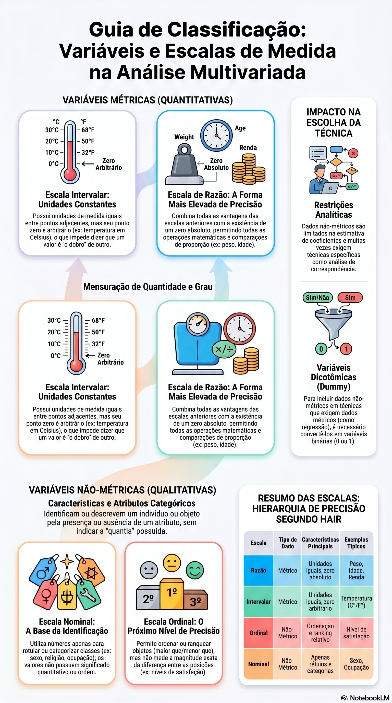

#+Title: Tipos de Variáveis

Anotações de estudos sobre tipos de variavéis

| Categoria Principal               | Tipo de Escala/Variável  | Descrição                                                                                                                                                       | Página (Hair et al.) | Referência                   |
|-----------------------------------+--------------------------+-----------------------------------------------------------------------------------------------------------------------------------------------------------------+----------------------+------------------------------|
| Dados Não-Métricos (Qualitativos) | Nominal                  | Utiliza números apenas para identificar ou rotular objetos indicando presença ou ausência de um atributo, sem valor quantitativo.                               | 24                   | [fn:144], [fn:149]           |
| Dados Não-Métricos (Qualitativos) | Ordinal                  | Permite ordenar ou ranquear os itens indicando posições relativas, mas sem quantificar a magnitude exata da diferença entre eles.                               | 24, 25               | [fn:144], [fn:150]           |
| Dados Métricos (Quantitativos)    | Intervalar               | Identifica o grau ou a magnitude do que está sendo mensurado com base em uma unidade de medida constante.                                                       | 24, 25               | [fn:144], [fn:151], [fn:152] |
| Dados Métricos (Quantitativos)    | De Razão (Proporcionais) | Mensura a magnitude possuindo um zero absoluto, o que permite que as medidas sejam expressas em múltiplos precisos.                                             | 24, 26               | [fn:144], [fn:152], [fn:153] |
| Variável Especial                 | Dicotômica (Dummy)       | Variável não-métrica transformada em uma variável métrica designando-se os valores de 1 ou 0 para representar a presença ou ausência de uma característica [1]. | 24, 32               | [fn:145], [fn:160]           |

#+caption: Gerada pelo notebookom com base no livro do hair
#+size: 

* referencias
* Referências
[fn:144] Página 144 do Hair
[fn:145] Página 145 do Hair
[fn:149] Página 149 do Hair
[fn:150] Página 150 do Hair
[fn:151] Página 151 do Hair
[fn:152] Página 152 do Hair
[fn:153] Página 153 do Hair
[fn:160] Página 160 do Hair

